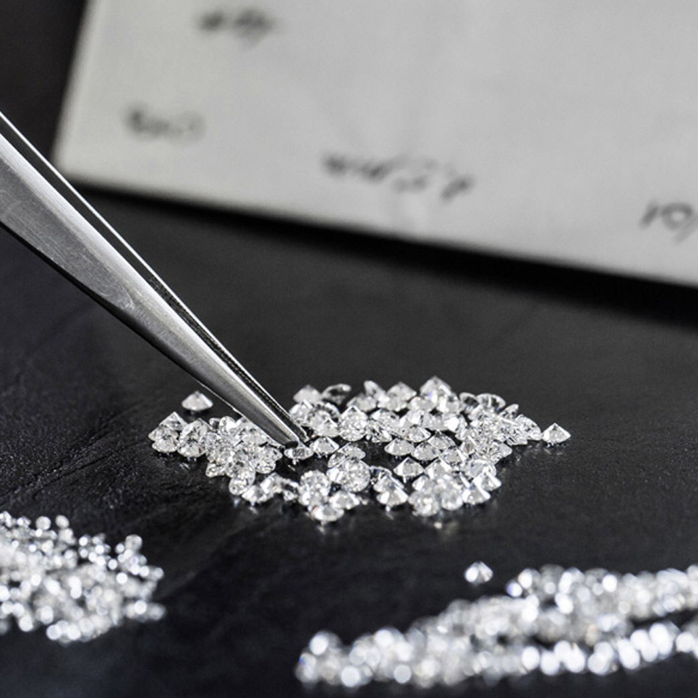

# __ih_datamadpt1121_project_m2__
## Ironhack Pawn Shop 2022

### Introduction of the project: 
Data analytics is oftentimes referred to as business intelligence, BI development, or product analytics. However, that is just the tip of the iceberg since the data analytics process includes activities such as data formation/creation, data cleansing, exploratory data analysis (especially this part), etc. 

In this case, the Second Project of Ironhack Data Analysis Part Time (Madrid) consisted in Data Visualization. 
We were asked to use the [__diamonds_m2.db__](https://github.com/ih-datapt-mad/ih_datamadpt1121_project_m2/blob/main/db/diamonds_m2.db) `SQLite` database in order to analyse and extract all the conclusions and insights of the data. 

## **Tools used in this project:** 

- `DBeaver` software to make all required SQL queries in order to prepare the data model
- `Tableau` public to analyse and construct the data model adapted to the Dashboard desired.

## **Step 1: Preparation of the data** 
1. Download of the database
2. Use SQLite as Server in DBeaver to open the database
3. Use DBeaver for SQL Queries
4. Export final dataset to .csv file
5. Open the dataset with Tableau Public

## **Step 2: Exploratory Analysis**
1. Descriptive statistics with Tableau
2. First insights of the data based on descriptive statistics
3. Graphical representation of descriptive statistics and relations

## **Step 3: Identification of needs to develop the dashboard and development of the dashboard** 
This was the longest step. 

__Aim:__ To create a single dashboard that allows a customer to see diamonds availability based on two parameters: one is the price (budget) and the other is a diamond feature that the customer will choice by him/herself regarding what is important to him/her (within the options: Cut, Color, Clarity). 

For that reason I needed a dynamic dashboard that changes with Customer's choices and that shows important data summarized in a clear visualization.

I created parameters to allow the customer to choice between some options and Calculated Fields based on those parameters. 

With that, I created the worksheet based on the Calculated Fields, obtaining a Dynamic dashboard that changes with Customer Decisions. 

## **Deliverables:**

A GitHub repository including:

- `SQL queries` with the queries that I used for .csv file obtantion. 

- `BI Report/Dashboard` meeting the requeriments specified in the project.

- `README.md` file explaining the job done and my main conclusions. 

---

## **Insights and conclusions:**

__During the exploratory analysis:__
* Regarding the descriptive statistics, I assume that there are outliers in the dataset that affects the mean price of the diamonds, regarless the group category. For example in the `Descriptive Analysis` page of the Story with `Clarity` as selected criteria, the table shows a difference of +1500€ between average price and median price (in favor of average price). This difference can be explained by the presence of outliers in the dataset. 

* Regarding the graphical representation of the exploratory analysis, I've seen that there are two atypical conditions: 
    1. Lower levels of Color have highest average prices. This is due to the distribution of the diamonds features that can be seen in the upper scatter plot of the `Exploratory analysis` page of the Story in which diamonds with lower level of color are shown in red. 
    2. Lower quality of cut have almost the highest average price. In this case, the distribution does not justify this event a priori, but if we have a closer look to the lower scatter plot of the `Exploratory analysis` page of the Story, we can see that the diamond with highest price and highest carat has a 'Fair' cut. This is a real example of how outliers can affect some central tendency measurements such as average. 

__After the project:__

For me, the main conclusion that I've obtained by working with this diamonds database is that the quality of a diamond is explained by different features that are objectively measure by professionals. Some of them are more important than others. This is the case of Carats: with carats, the bigger the more expensive. But this only represents the size of the diamond, not the quality in terms of the others features. 

Regarding the others features of a diamond (Color, Clarity, Cut), even though they're important and objective measurements, they're not correlated. That means that a diamond with the best Cut does not have necessarily the best Color and viceversa (and the same happens with Clarity). This is the reason why establishing a real accurate price of a diamond or choose a diamond based on this features is too difficult and we usually end choosing by Carats. 

This conclusion is in line with the Aim of the dashboard: to allow a customer choose based in other features, not only Carats.